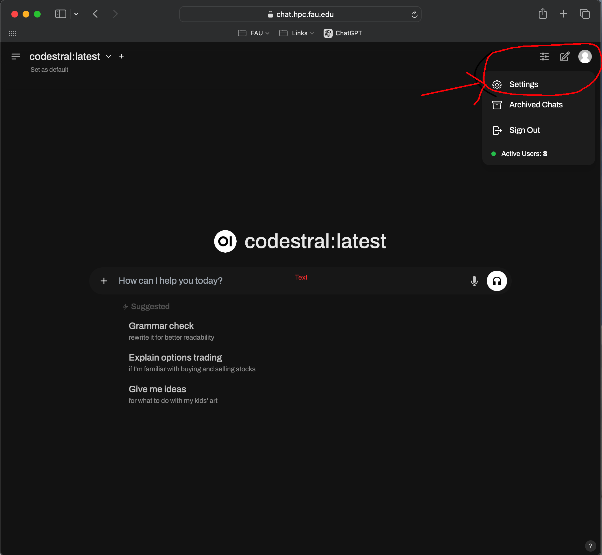
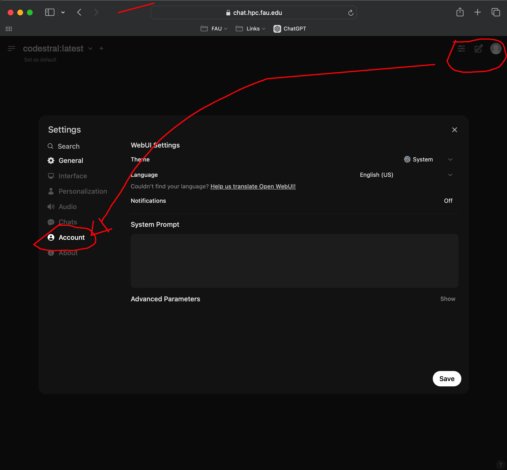
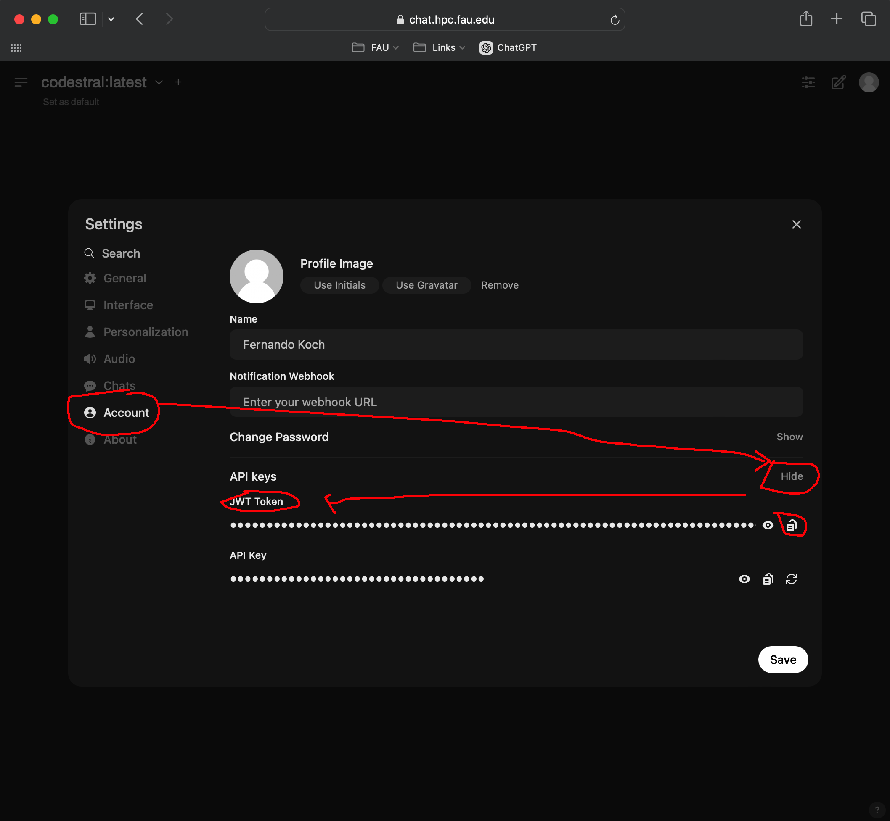

### [Understand](./README.md) | [Get Started](./README.md#getting-started) | [Contribute](./CONTRIBUTING.md)


# Configuring the Owlmind Framework for FAU students

* [General Audience](./CONFIG.md)
* [FAU Students](./CONFIG-FAU.md)

* Troubleshooting information at [TROUBLESHOOTING.md](./TROUBLESHOOTING.md)

The configuration requires:
* the **Owlmind Framework**, which provides the simulated GenAI pipeline, and;
* a **Model Server**, which for FAU students can be either a locally installed **Ollama Server** OR use [chat.hpc.fau.edu](https://chat.hpc.fau.edu).

You have a more options (than the general public) for this configuration:

* (Option 1): Install both **Owlmind Framework** and **OLLAMA Server** on the same computer (RECOMMENDED)
* (Option 2): Install **Owlmind Framework** on one computer and use the **OLLAMA Server** installed on other computer in the same network (or accessible through the Internet, if feasible)
* (Option 3): Install **Owlmind Framework** on your computer and integrate to [chat.hpc.fau.edu](https://chat.hpc.fau.edu).(SECOND BEST)


We recommend using [Visual Code Studio](https://code.visualstudio.com) and installing everything on your computer.

For (Option 1) and (Option 2) follow the same instructions as in [General Audience](./CONFIG.md)


For (Option 3) and (Option 4), the installing steps include:
* (Step 1) Downloading **Owlmind Framework** on your computer
* (Step 2) Connecting the **Owlmind Framework** to [chat.hpc.fau.edu](https://chat.hpc.fau.edu).
* (Step 3) Test the Environment


# (Step 1) Downloading **Owlmind Framework** on your computer

This is the same as (Step 2) in [General Audience](./CONFIG.md)

Please follow those instructions!

# (Step 2) Connecting the **Owlmind Framework** to chat.hpc.fau.edu

You need to configure the Environment so that the **Owlmind Framework** connected to your Model Server at [chat.hpc.fau.edu](https://chat.hpc.fau.edu).

For that, you will need to:
* (Step 2.a) Collect the API_KEY from [chat.hpc.fau.edu](https://chat.hpc.fau.edu)
* (Step 2.b) Setup the `prompt_eng/_config` file


## (Step 2.a) Collect the API_KEY from chat.hpc.fau.edu

At FAU, we have our shared OLLAMA Server that can be accessed through an Open-WebUI interface at:

[https://chat.hpc.fau.edu](https://chat.hpc.fau.edu)

To use this service for our setup, you must generate and configure the API_KEY.

#### Finding **YOUR_API_KEY_HERE** 

1. Go to [https://chat.hpc.fau.edu](https://chat.hpc.fau.edu)
2. After login with your @fau account, go to `Your Account` (top-left)



3. Next, go to `Accounts` tab on the right



4. Then , click on `Show` API Keys and copy the `JWST Key` 




## (Step 2.b) Setup the `.env` file


```bash
##
## EXAMPLE FOR .env file
## Rename this file to .env and complete the tokens
##

DISCORD_TOKEN=Your_Discord_Token
#SERVER_TYPE=ollama
#SERVER_URL=http://localhost:11434

SERVER_MODEL=llama3.2
SERVER_TYPE=open-webui
SERVER_URL=https://chat.hpc.fau.edu
SERVER_API_KEY=API_KEY_for_your_model_provider

```

# (Step 3) Test the Environment

Follow the same instructions from:
* [General Audience](./CONFIG.md#step-3-test-the-environment)

