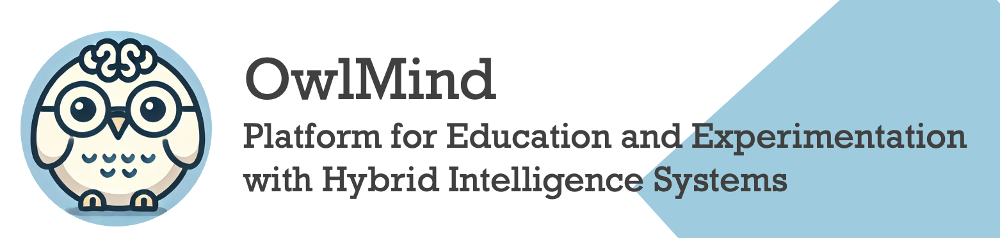

### [Understand](./README.md) | [Get Started](./README.md#getting-started) | [Contribute](./CONTRIBUTING.md)


# Contributing to OwlMind

Welcome! OwlMind Framework is a community project that aims at a Framework for Education and Experimentation with Generative Intelligence System. If you're trying OwlMind Framework on your Education projects, your experience and what you can contribute are
important to the project's success.

If you're looking for things to help with, browse our [issue tracker](https://github.com/genilab-fau/owlmind/issues)!


## Code of Conduct

Everyone participating in the OwlMind Framework community, and in particular in our
issue tracker, pull requests, and chat, is expected to treat
other people with respect and more generally to follow the guidelines
articulated in the [Python Community Code of Conduct](https://www.python.org/psf/codeofconduct/).

## Getting started with development

### Setup

#### (1) Fork the Owlmind repository

Within GitHub, navigate to <https://github.com/genilab-fau/owlmind> and fork the repository.

#### (2) Clone the Owlmind repository and enter into it

```bash
git clone git@github.com:genilab-fau/owlmind.git
cd pwlmind
```

#### (3) Create then activate a virtual environment

```bash
python3 -m venv venv
source venv/bin/activate
```

```bash
# For Windows use
python -m venv venv
. venv/Scripts/activate

# For more details, see https://docs.python.org/3/library/venv.html#creating-virtual-environments
```

#### (4) Install the requirements and the project

```bash
python -m pip install -r requirements.txt
python -m pip install -e .
hash -r  # This resets shell PATH cache, not necessary on Windows
```

> **Note**
> You'll need Python 3.11 or higher

[README](./README.md) provides a description about the solution architecture and how to get started.

## First time contributors

If you're looking for things to help with, browse our [issue tracker](https://github.com/genilab-fau/owlmind/issues)!

In particular, look for entries in these categories, depending on your interests and skills:

- [good first issues](https://github.com/genilab-fau/owlmind/labels/good-first-issue)
- [documentation issues](https://github.com/genilab-fau/owlmind/documentation)
- [enhancements](https://github.com/genilab-fau/owlmind/labels/enhancement)
- [challenges](https://github.com/genilab-fau/owlmind/labels/challenges)


You do not need to ask for permission to work on any of these issues.
Just fix the issue yourself, [try it](./README.md#getting-started) 
on your installation and and [open a pull request](#submitting-changes).

To get help fixing a specific issue, it us often best to add a comment to the issue
itself. You're much more likely to get help if you provide details about what
you've tried and where you've looked (maintainers tend to help those who help
themselves). 

To learn more about issue management, 
[check this document](https://docs.github.com/en/issues/tracking-your-work-with-issues/using-issues)

## Submitting changes

Even more excellent than a good bug report is a fix for a bug, or the
implementation of a much-needed new feature. We'd love to have
your contributions.

We use the usual GitHub pull-request flow, which may be familiar to
you if you've contributed to other projects on GitHub.  For the mechanics,
see [GitHub's documentation on Pull Requests](https://help.github.com/articles/using-pull-requests/).

Anyone interested in Owlmind may review your code.  One of the Owlmind core
developers will merge your pull request when they think it's ready.

### For extensive work

If your change will be a significant amount of work
to write, we highly recommend starting by opening an issue laying out
what you want to do.  This will allow us to have a conversation and find out whether 
there are any considerations about what you would like to do and, eventually,
bring up have ideas that may help you.

### To create good PULLs

The best pull requests are focused, clearly describe their purpose, and make sure
anyone fells comfortable they have been trhoguhfully tested and will work well. 
Some good advices compiled from different sources:

* PR contains a single logical change. Grouping multiple not directly related changes 
into a single PR makes them slower to review.
* PR has tests (if relevant). If there are no tests, we'll probably ask you to write them. 
In some cases (most notably platform compatibility), we may do manual testing instead.
* PR has clean CI builds and merges cleanly.
* PR has a message or comments that explain what the PR does in some detail, and why this 
is useful. For small changes this is less important, but the more complex the change, 
the more important this is.
* There is an open issue in our [issue tracker](https://github.com/genilab-fau/owlmind/issues) 
related to your PR that has been discussed, and there are no unresolved objections 
or open questions. 
* PRs that address issues in more imminent milestones get priority when reviewing.

Also, do not squash your commits after you have submitted a pull request, as this
erases context during review. We will squash commits when the pull request is merged.


## Core developer guidelines

Core developers should follow these rules when processing pull requests:

* Always wait for tests to pass before merging PRs.
* Use "[Squash and merge](https://github.com/blog/2141-squash-your-commits)"
  to merge PRs.
* Delete branches for merged PRs (by core devs pushing to the main repo).
* Edit the final commit message before merging to conform to the following
  style (we wish to have a clean `git log` output):
  * When merging a multi-commit PR make sure that the commit message doesn't
    contain the local history from the committer and the review history from
    the PR. Edit the message to only describe the end state of the PR.
  * Make sure there is a *single* newline at the end of the commit message.
    This way there is a single empty line between commits in `git log`
    output.
  * Make sure that the subject of the commit message has no trailing dot.
  * If the PR fixes an issue, make sure something like "Fixes #xxx." occurs
    in the body of the message (not in the subject).
  * Use Markdown for formatting.