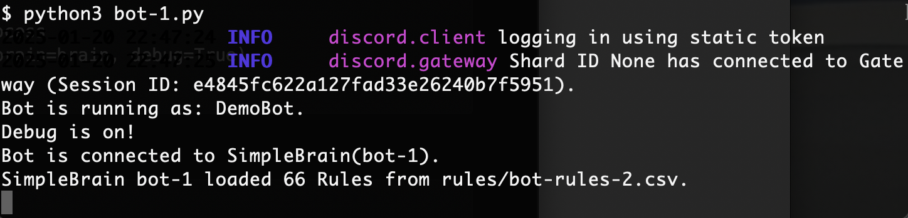
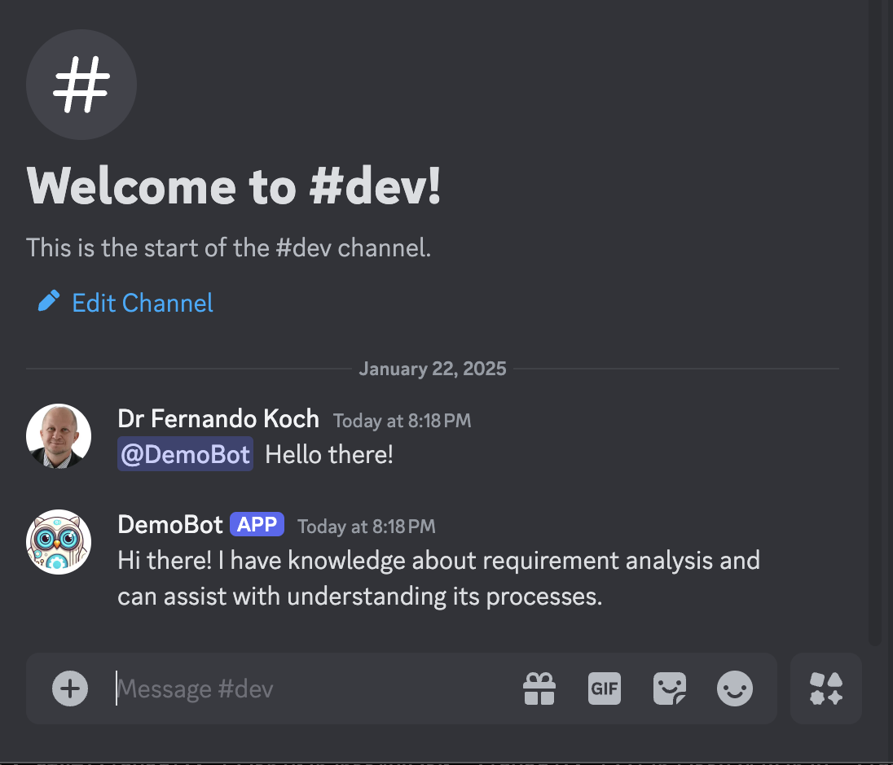

### [Understand](./README.md) | [Get Started](./README.md#getting-started) | [Contribute](./CONTRIBUTING.md)


# INSTALLING 

During this process you will:

1. Install OwlMind locally
2. Configure your Discord Bot  
3. Connect your Discord Bot with a simple OwlMind BotEngine 
4. (optional) Connect to a GenAI Model Provider

Troubleshooting information at [TROUBLESHOOTING.md](./TROUBLESHOOTING.md)

### 1. Install OwlMind locally

Before you continue:
* You'll need Python 3.11+, pip, and git
* [How to install PYTHON and PIP?](https://packaging.python.org/en/latest/tutorials/installing-packages/)
* [How to install GIT?](https://github.com/git-guides/install-git)


#### Clone the source from GitHub:

```bash

git clone https://github.com/genilab-fau/owlmind.git owlmind
cd owlmind

```

#### Install the requirements

Run this command inside the folder you downloaded above.

Note: eventually in your system it will be ``python`` instead of ``python3``.

```bash
cd owlmind
python3 -m pip install --break-system-packages -r requirements.txt
hash -r  # This resets shell PATH cache, not necessary on Windows
```
#### Optional : Install Dev Requirments
```bash
python3 -m pip install --break-system-packages -r requirements-dev.txt
```

#### Optional : Run Unit Tests
```bash
python -m pytest -vm unit --cov=owlmind --cov-report=term-missing
```


### 2. Configure your Discord Bot 

Follow the instructions at: [How-to Create an Discord Bot?](docs/discord.md)

* **Save the TOKEN** that you created thought this process; we will use it in Step 
* **Provide the URL to the Discord Server admin** for adding to the server. 
* Notice that **the Bot will be offline**  until you connect to the Bot Runner (next).


### 3. Animate your Discord Bot with an OwlMind BotEngine


#### Setup the Discord Bot TOKEN
* Get the TOKEN you created above
* Create the file .env inside folder you installed owlming (e.g. ./owlmind)

```bash

DISCORD_TOKEN=Your_Token_Goes_Here

```

Alternatively, you can hard-code the TOKEN within bot-1.py:

```python
(...)
if __name__ == '__main__':
    (...)

    ## Alternative: Hard-code your TOKEN here and remote the comment:
    TOKEN="My_Token_Goes_Here"

    (...)
    # Kick start the Bot Runner process
    bot = DiscordBot(token=TOKEN, brain=brain, debug=True)
    bot.run()
```


#### Execute the 'getting started' BotMind

```bash
$ python3 bot-1.py
```

It should startup like this:



At this point your Bot should be animated and you can chat with it on Discord:




## 4. (optional) Connect to a GenAI-Model Provider

To connect to a GenAI Model provider:
* [General Audience](./CONFIG.md)
* [FAU Students](./CONFIG-FAU.md)


