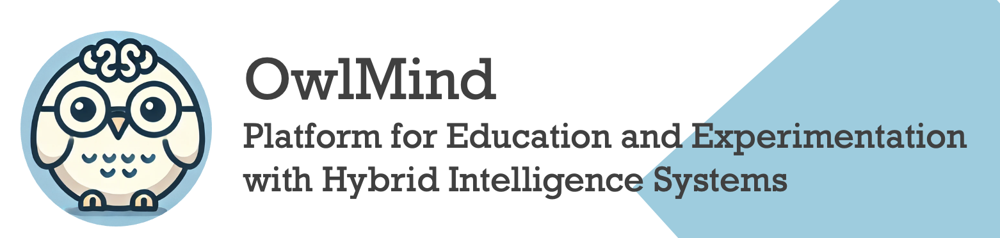

### [Understand](./README.md) | [Get Started](./README.md#getting-started) | [Contribute](./CONTRIBUTING.md)

# OwlMind 

The OwlMind Framework is being developed by The Generative Intelligence Lab at Florida Atlantic University to support education and experimentation with Hybrid Intelligence Systems. These solutions combine rule-based and generative AI (GenAI)-based inference to facilitate the implementation of local AI solutions, improving latency, optimizing costs, and reducing energy consumption and carbon emissions.

The framework is designed for both education and experimentation empowering students and researchers to rapidly build Hybrid AI-based Agentic Systems, achieving tangible results with minimal setup.

## Core Components

* **Bot Runner for Discord Bots:** Hosts and executes bots on platforms like Discord, providing users with an interactive conversational agent.
* **Agentic Core:** Enables deliberation and decision-making by allowing users to define and configure rule-based systems.
* **Configurable GenAI Pipelines:** Supports flexible and dynamic pipelines to integrate large-scale GenAI models into workflows.
* **Workflow Templates:** Provides pre-configured or customizable templates to streamline the Prompt Augmentation Process.
* **Artifacts:** Modular components that connect agents to external functionalities such as web APIs, databases, Retrieval-Augmented Generation (RAG) systems, and more.
* **Model Orchestrator:** Manages and integrates multiple GenAI models within pipelines, offering flexibility and simplicity for developers.

## Hybrid Intelligence Framework

The OwlMind architecture follows the principles of ``Hybrid Intelligence``, combining local rule-based inference with remote GenAI-assisted inference. This hybrid approach allows for multiple inference configurations:

* **GenAI generates the rules:**  The system leverages GenAI to create or refine rule-based logic, ensuring adaptability and efficiency.
* **Rules solve interactions; GenAI intervenes when needed:** if predefined rules are insufficient, the system escalates decision-making to the GenAI model.
* **Rules solve interactions and request GenAI to generate new rules:** instead of directly relying on GenAI for inference, the system asks it to expand its rule set dynamically.
* **Proactive rule generation for new contexts:** the system anticipates novel situations and queries GenAI for relevant rules before issues arise, ensuring continuous learning and adaptability.

## Agentic Core: Belief-Desire-Intention (BDI) Model

The ``Agentic Core`` adheres to the ``Belief-Desire-Intention (BDI) framework``, a cognitive architecture that enables goal-oriented agent behavior. The decision-making process is structured as follows:

* **Beliefs:** The agent's knowledge or perception of its environment, forming the foundation for evaluation and decision-making.
* **Desires:** The agent’s objectives or goals, such as completing workflows, retrieving data, or responding to user queries.
* **Intentions:** The specific plans or strategies the agent commits to in order to achieve its desires, ensuring feasibility and optimization.
* **Plan Base:** A repository of predefined and dynamically generated plans, serving as actionable roadmaps to execute the agent's goals efficiently.
* **Capability Base:** Defines the agent's operational capabilities, specifying available actions and interactions; linked to existing Artifacts.

## Getting Started

* [Install the Owlmind Framework on your Computer](./INSTALLING.md)
* [Set up a simple HybridAI-Based Discord Bot](./INSTALLING.md)
* [Configure GenAI Pipelines](./CONFIG.md) to extend the Bot's conversation capabilities
* Configure Prompt Engineering Workflows to improve the Bot's reasoning.
* Configure Artifacts in the GenAI Pipelines to extend the Bot's reasoning capabilities

